# Arduino AWS IoT

Arduino MKR Zero で収集したセンサーデータを Raspberry Pi 経由で AWS IoT Core に送信し、ブラウザのダッシュボードでリアルタイム監視・制御するシステムです。

## システム構成

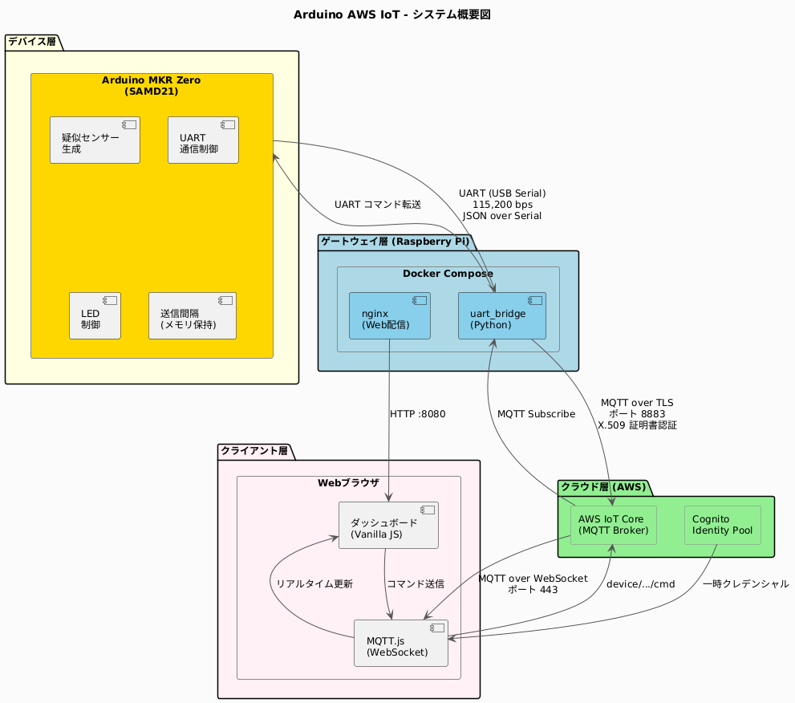

| コンポーネント | 役割 |
|---|---|
| Arduino MKR Zero (SAMD21) | 温湿度センサーデータの生成・UART 送信・コマンド受信 |
| Raspberry Pi 4 (Gateway) | UART 中継・MQTT ブローカーとの通信・オフラインバッファリング |
| AWS IoT Core | MQTT メッセージブローカー・デバイス認証 |
| Web ブラウザ | リアルタイムダッシュボード・LED 制御・送信間隔変更 |

## 主な機能

### テレメトリ（Arduino → Web UI）

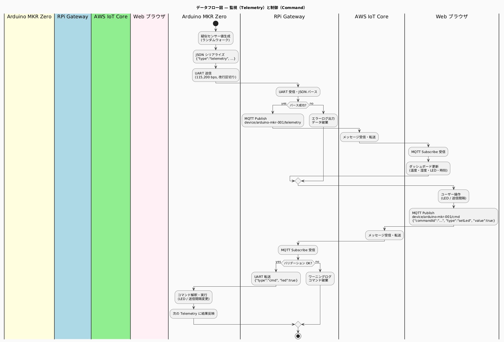

- Arduino が 10 秒間隔（5〜30 秒で変更可能）で温度・湿度・LED 状態を JSON で UART 送信
- Gateway が受信・パースし、AWS IoT Core の `device/{id}/telemetry` トピックへ MQTT Publish（retain=true）
- Web UI がブラウザの WebSocket で Subscribe し、グラフ・数値をリアルタイム更新

### コマンド（Web UI → Arduino）

- Web UI から LED ON/OFF・送信間隔変更コマンドを `device/{id}/cmd` トピックへ Publish
- Gateway が Subscribe して受信・バリデーション・重複排除したうえで UART 経由で Arduino へ転送
- 次の Telemetry で状態変化を確認（Fire-and-Confirm 方式）

### 接続状態管理

- Gateway はテレメトリ受信ごとに `device/{id}/status` へ `{"state":"online"}` を Publish（retain=true）
- 一定時間途絶えると `degraded`、プロセス終了時は LWT で `offline` を送信

## 技術スタック

| レイヤー | 技術 |
|---|---|
| ファームウェア | Arduino / C++ / ArduinoJson |
| Gateway | Python 3.11 / asyncio / AWS IoT SDK v2 / pyserial |
| インフラ | AWS IoT Core / Cognito Identity Pool / Terraform |
| コンテナ | Docker (linux/arm64) / Docker Compose |
| Web UI | Vanilla JS / MQTT.js / Chart.js / AWS SDK v2 |
| 認証（Gateway） | mTLS（X.509 デバイス証明書） |
| 認証（Web UI） | Cognito 非認証 ID + SigV4 署名 WebSocket |

## MQTT トピック

| トピック | 方向 | retain | 内容 |
|---|---|---|---|
| `device/{id}/telemetry` | Gateway → Web UI | true | 温度・湿度・LED 状態・シーケンス番号 |
| `device/{id}/status` | Gateway → Web UI | true | `online` / `degraded` / `offline` |
| `device/{id}/cmd` | Web UI → Gateway | false | LED ON/OFF・送信間隔変更コマンド |

## ディレクトリ構成

```
.
├── firmware/arduino_mkr_zero/   # Arduino スケッチ (C++)
├── gateway/                     # Raspberry Pi Gateway (Python)
├── web/                         # ダッシュボード (HTML/CSS/JS)
├── deploy/
│   ├── docker-compose.yml       # Gateway + nginx 構成
│   └── scripts/
│       ├── build.sh             # ARM64 クロスビルド
│       └── deploy.sh            # RPi へのデプロイ
├── terraform/                   # AWS リソース定義
└── docs/                        # 設計ドキュメント
```

## セットアップ

### 1. AWS リソースの作成

```bash
cd terraform
terraform init
terraform apply
```

`terraform output` で取得した値を設定ファイルに反映します。

```bash
# IoT エンドポイントとデバイス ID を設定
cp .env.example .env
vi .env  # IOT_ENDPOINT を terraform output の値で更新

# Web UI の設定
vi web/js/config.js  # iotEndpoint / cognitoPoolId を terraform output の値で更新
```

### 2. 証明書を Raspberry Pi に配置

```bash
# Terraform が terraform/certs/ に自動生成した証明書を RPi へコピー
scp terraform/certs/{certificate.pem,private.key,root_ca.pem} \
    user@raspberrypi:~/arduino_aws_iot/certs/
scp .env user@raspberrypi:~/arduino_aws_iot/
```

### 3. Arduino ファームウェアの書き込み

Arduino IDE で `firmware/arduino_mkr_zero/arduino_mkr_zero.ino` を開き、Arduino MKR Zero に書き込みます。

必要なライブラリ: **ArduinoJson 7.x**

### 4. Gateway のビルドとデプロイ

```bash
# ARM64 向けクロスビルド（Docker buildx が必要）
bash deploy/scripts/build.sh

# Raspberry Pi へデプロイ
RPI_USER=<user> bash deploy/scripts/deploy.sh
```

### 5. Web ダッシュボードへのアクセス

```
http://<raspberry-pi-ip>:8090
```

## ドキュメント

### 設計書

| ドキュメント | 概要 |
|---|---|
| [要件定義](docs/01_requirements/requirements.md) | システム要件・機能要件 |
| [基本設計](docs/02_basic_design/basic_design.md) | アーキテクチャ・データフロー・MQTT 設計 |
| [詳細設計](docs/03_detailed_design/detailed_design.md) | クラス設計・シーケンス・エラーハンドリング |

### 図一覧

**基本設計**

| 図 | プレビュー |
|---|---|
| システム概要図 |  |
| データフロー図 |  |
| デプロイ構成図 | 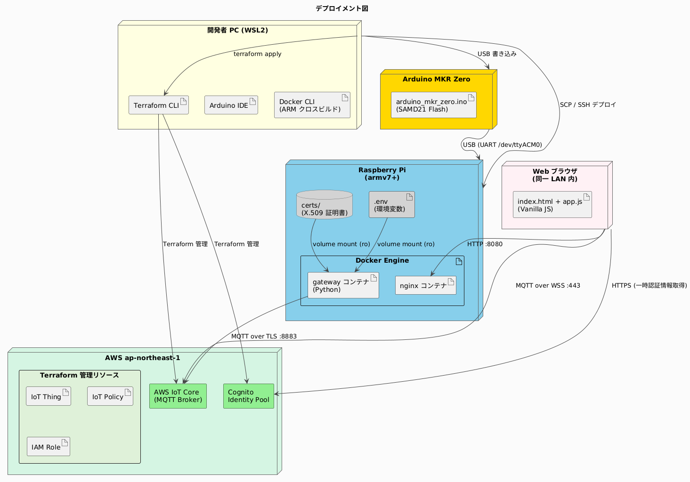 |

**詳細設計**

| 図 | プレビュー |
|---|---|
| クラス図（Gateway） | 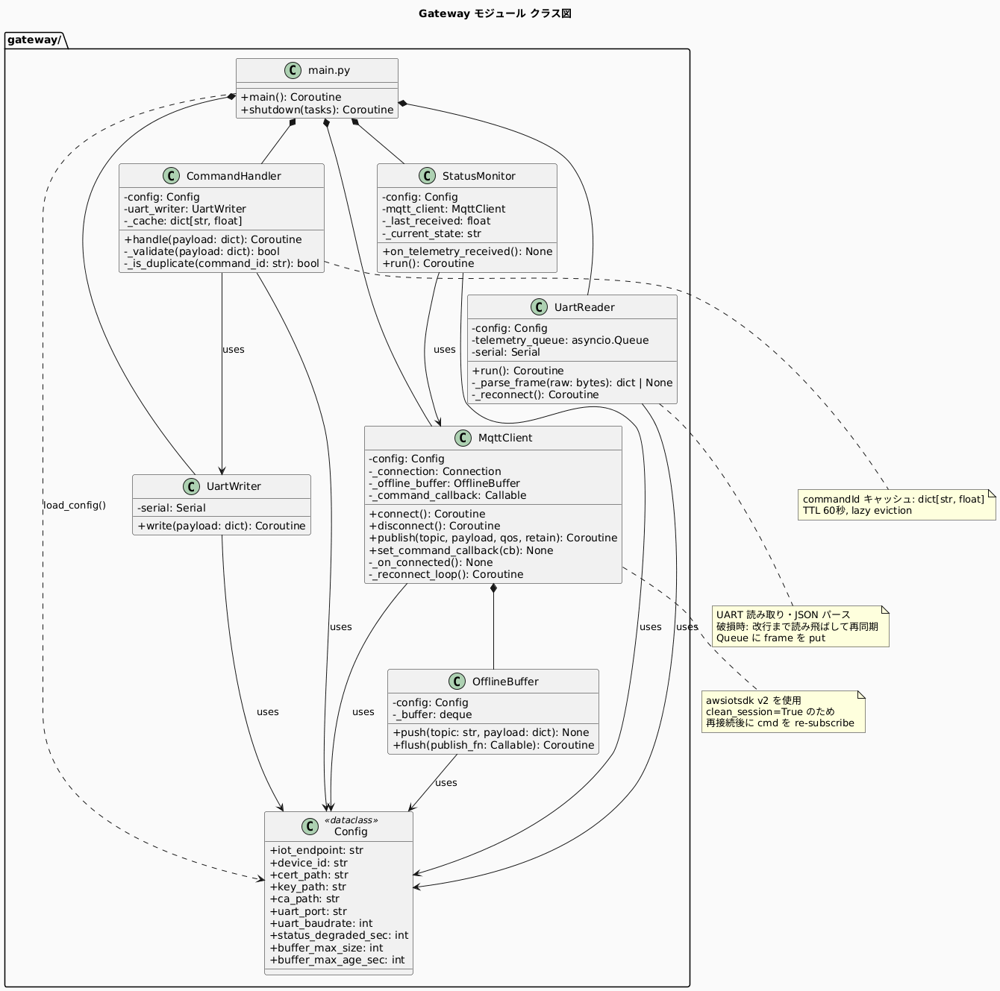 |
| シーケンス図（起動） | 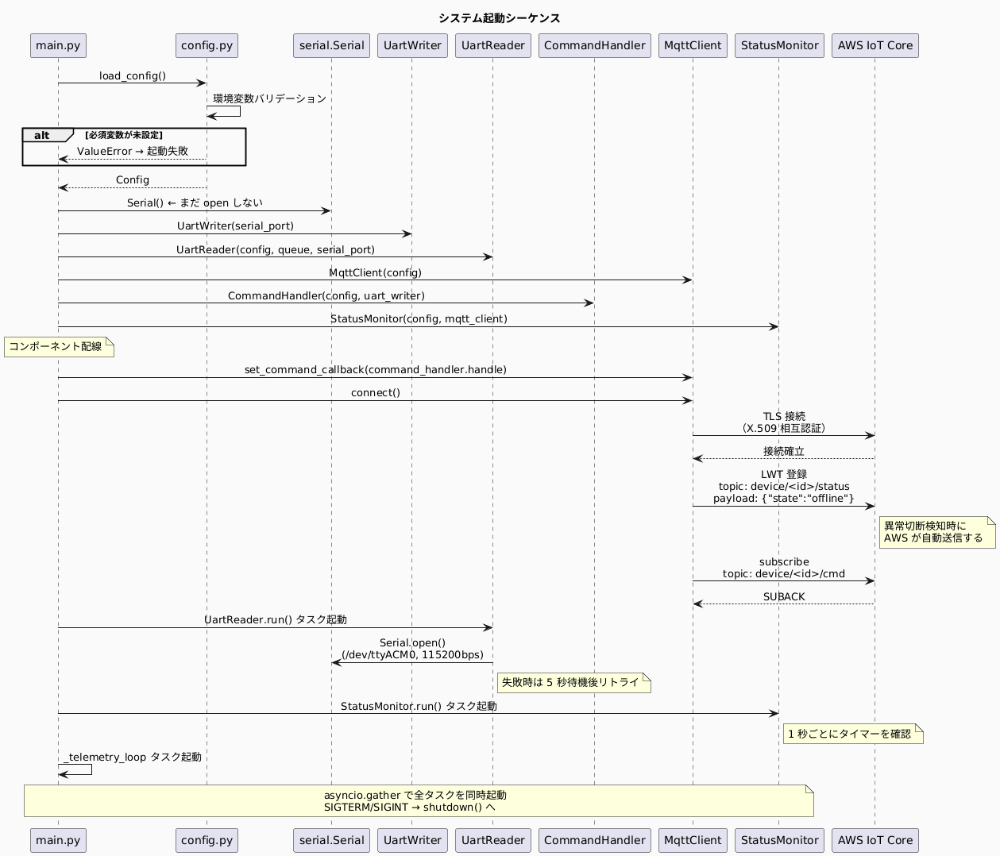 |
| シーケンス図（テレメトリ） | 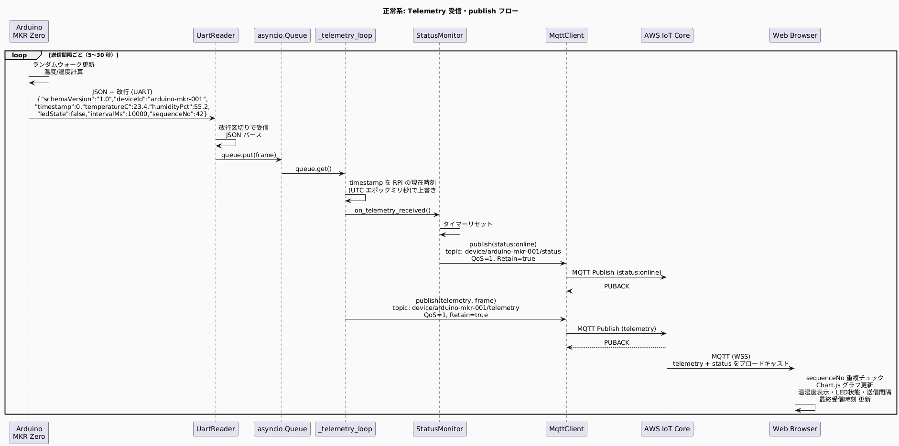 |
| シーケンス図（コマンド） | 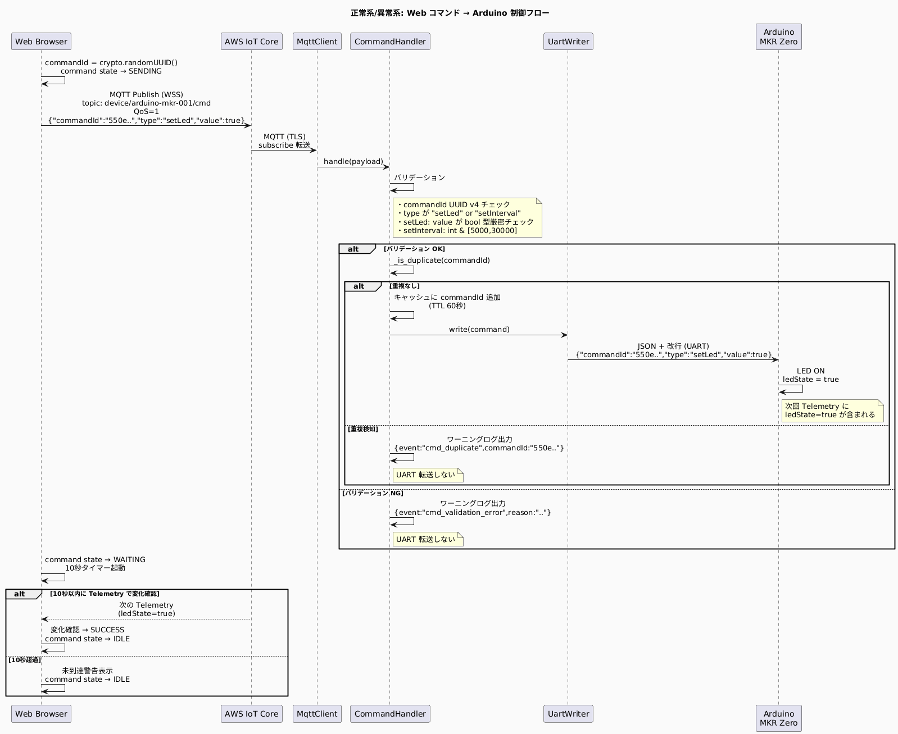 |
| シーケンス図（MQTT エラー） | 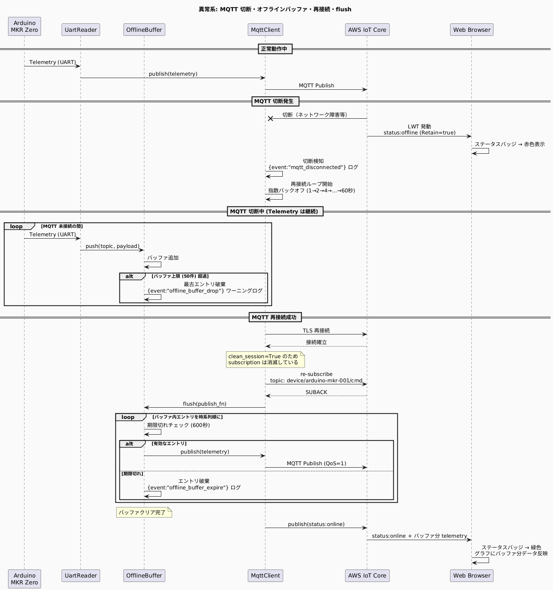 |
| シーケンス図（UART エラー） | 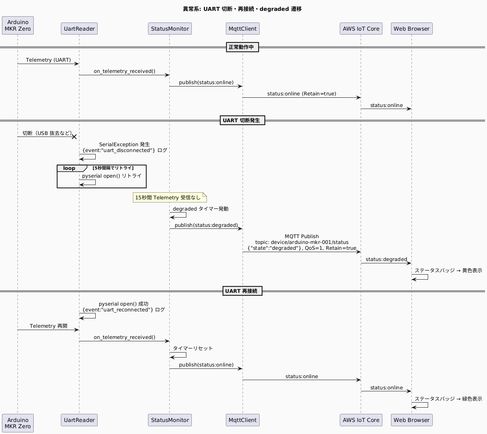 |
| アクティビティ図（Arduino） | 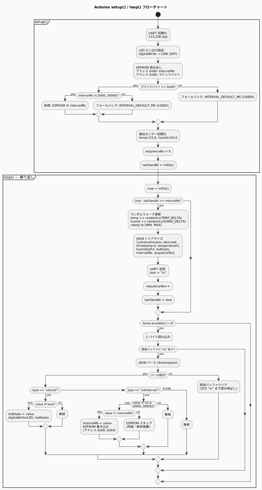 |
| 状態遷移図（接続状態） | 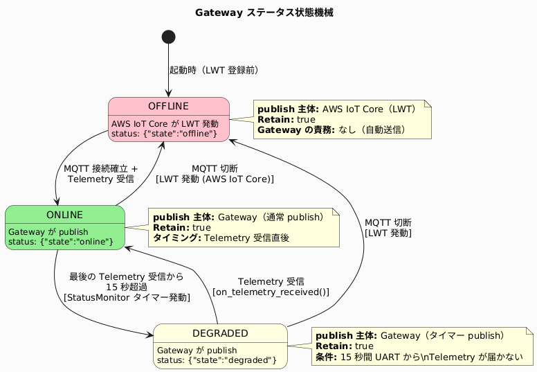 |

## License

MIT
